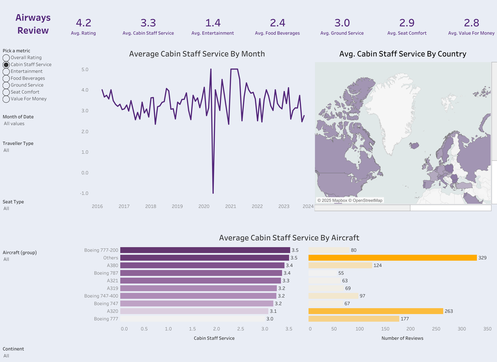

# Airways Review Dashboard ✈️

Interactive Tableau dashboard analyzing **British Airways customer reviews**.  
This project was created as an **end-to-end portfolio project** to demonstrate data visualization, interactivity, and storytelling in Tableau.

---

## 📌 Project Overview
The goal of this project was to create an **interactive business intelligence dashboard** that allows users to explore customer reviews dynamically.  
Key design principles:
- Enable end users to **pick metrics** (overall rating, food, entertainment, seat comfort, etc.) via a parameter toggle.
- Provide **filters** for traveler type, seat type, aircraft type, date range, and continent.
- Make each visualization act as a **dynamic filter** (clickable interactions).
- Build a **professional summary layout** with KPI cards, time trends, geographic insights, and aircraft-level benchmarking.

---

## 📊 Data & Dashboard Overview
- **Data Sources**:  
  - `ba_reviews.csv`: Review-level data for British Airways (ratings, aircraft, seat type, traveler type, date, place, etc.)  
  - `countries.csv`: Country mapping table for geographic visualization.  

- **Key Metrics Visualized**:
  - Average Rating  
  - Cabin Staff Service  
  - Entertainment  
  - Food & Beverages  
  - Ground Service  
  - Seat Comfort  
  - Value for Money  

- **Dashboard Components**:
  1. **KPI Summary Cards**: Top-level averages of all review metrics.  
  2. **Trend Analysis**: Line chart of selected metric over time.  
  3. **Geographic Analysis**: Map showing average rating by country with continent filter.  
  4. **Aircraft Analysis**: Dual-axis bar chart showing average cabin staff service vs. number of reviews for different aircraft groups.  
  5. **Interactive Filters**:  
     - Metric selector (parameter)  
     - Date range  
     - Traveler type  
     - Seat type  
     - Aircraft group  
     - Continent  

---

## 🔍 Key Insights
1. **Cabin Staff Service Variability**: Scores hover around 3.0–3.5 across aircraft, with A380 and 777-200 slightly outperforming narrow-body aircraft.  
2. **Entertainment Weakness**: Average rating of 1.4 highlights a major service gap, consistently underperforming other categories.  
3. **Geographic Disparity**: Reviews from Europe and North America report higher ratings compared to certain Asian markets, suggesting regional expectation gaps.  

---

## 💡 Recommendations
1. **Upgrade In-flight Entertainment**  
   - With the lowest average (1.4), BA should prioritize modernizing IFE systems on long-haul routes.  
   - Consider partnerships with streaming providers or portable device integration.

2. **Aircraft-Specific Cabin Crew Training**  
   - Variability in staff ratings across aircraft suggests inconsistency.  
   - Standardized training by aircraft type could raise the baseline service level, particularly on A320 and 777 fleets.

3. **Localized Customer Experience Strategy**  
   - Address lower satisfaction scores in Asian routes by tailoring food, beverage, and communication styles to regional expectations.  
   - This could include menu customization, multilingual crew assignments, and proactive feedback loops.

---

## 📂 Files
- `Dashboard.twbx`: Tableau packaged workbook (open in Tableau Public/Desktop).  
- `ba_reviews.csv`: Customer review dataset.  
- `countries.csv`: Country mapping dataset.  

---

## 🌐 Links
- [Interactive Dashboard on Tableau Public]([YOUR_TABLEAU_PUBLIC_LINK_HERE](https://public.tableau.com/app/profile/haneul.kim8784/viz/AirwayReviewDashboard/Dashboard1))  
- [Guided Video](https://youtu.be/KlAKAarfLRQ?si=356kAhbicycHIf6T)

